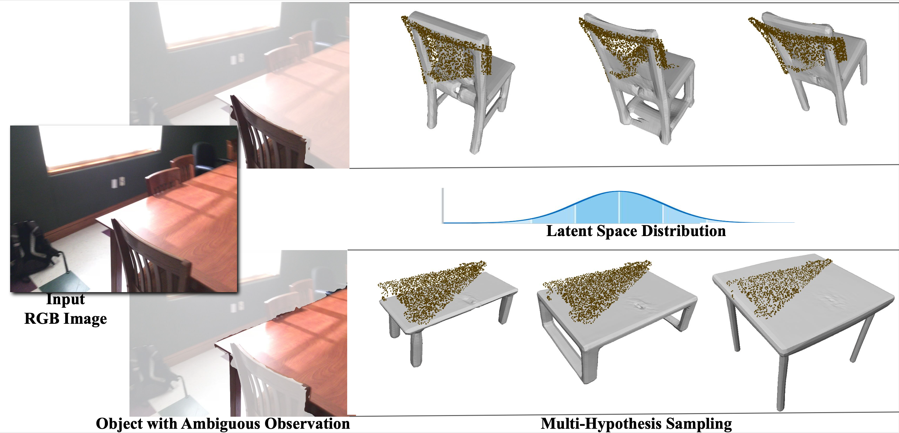

# PT43D: A Probabilistic Transformer for Generating 3D Shapes from Single Highly-Ambiguous RGB Images
[[`arXiv`](https://arxiv.org/abs/2405.11914)]
[[`BibTex`](#citation)]
[[`Video`](https://youtu.be/b_-U7dXalAs?si=twE6gemtEQ4bUJ6h)]

Official implementation for BMVC 2024 paper "PT43D: A Probabilistic Transformer for Generating 3D Shapes from Single Highly-Ambiguous RGB Images".


We propose a new approach for generating the probabilistic distribution of 3D shape reconstructions conditioned on a highly ambiguous RGB image, enabling multiple diverse sampled hypotheses during inference.

# Installation
Please setup the environment using `conda`:

```
conda env create -f pt43d.yaml
conda activate pt43d
```

# Preparing the Data
1. Synthetic Data

We render CAD models from [ShapeNet](https://www.shapenet.org) to generate synthetic images to mimic real-world challenges including occlusion and field-of-view truncation. Synthetic training / validation data can be downloaded [here](). We follow the official splits provided by ShapeNet. For each CAD model, we create 21 renderings to capture varying degree of ambiguity. Each rendering can be mapped to potential multiple ground-truth CAD models. Specifically, `*.txt` contains ground-truth CAD id(s) for `*.png`, where `*` is from 0 to 20.

2. Real-World Data

We adopt real-world image data from [ScanNet](http://www.scan-net.org/) for our experiments. Training set can be downloaded [here]() and validatioon set can be downloaded [here](). We generate per-instance images without background using masks provided by ground-truth annotations (training set) or neural machine [ODISE](https://github.com/NVlabs/ODISE) (validation set). We align each instance image to ground-truth CAD model using annotations provided by [Scan2CAD](https://github.com/skanti/Scan2CAD). For each category, the images are indexed from 0. Specifically, `*.jpg` is the instance image without background, `*.npy` contains the visible points, `*.pt` contains resized tensor without normalization for the corresponding instance image, `*.txt` contains ground-truth CAD id, `*_mask.jpg` is the mask and `*_original_image.txt` contains the path of the original image in ScanNet, where `*` is from 0.

# Training
1. First train the `P-VQ-VAE` on `ShapeNet`:
```
./launchers/train_pvqvae_snet.sh
```

2. Then extract the code for each sample of ShapeNet (caching them for training the transformer):
```
./launchers/extract_pvqvae_snet.sh
```

3. Train the probabilistic transformer to learn the shape distribution conditioned on an RGB image:
```
./launchers/train_pt43d.sh
```
# Pretrained Checkpoints
1. [P-VQ-VAE]().

2. PT43D being trained on synthetic training pairs - [PT43D_synthetic]().

3. PT43D being fine-tuned on real-world training pairs - [PT43D_real-world]().

# <a name="citation"></a> Citation

If you find this code helpful, please consider citing:
```BibTeX
@misc{xiong2024pt43d,
      title={PT43D: A Probabilistic Transformer for Generating 3D Shapes from Single Highly-Ambiguous RGB Images}, 
      author={Yiheng Xiong and Angela Dai},
      year={2024},
      eprint={2405.11914},
      archivePrefix={arXiv},
      primaryClass={cs.CV}
}
```

# Acknowledgement
This work was supported by the ERC Starting Grant SpatialSem (101076253). This code borrowed heavily from [AutoSDF](https://github.com/yccyenchicheng/AutoSDF). Thanks for the efforts for making their code available!
